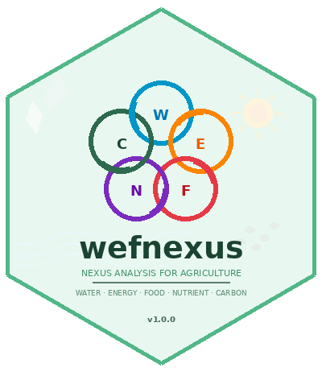

# wefnexus 

<!-- badges: start -->
[](https://github.com/lalitrolaniya/wefnexus/actions/workflows/R-CMD-check.yaml)
[](https://CRAN.R-project.org/package=wefnexus)
[](https://doi.org/10.32614/CRAN.package.wefnexus)
[](https://www.gnu.org/licenses/gpl-3.0)
[](https://CRAN.R-project.org/package=wefnexus)
[](https://CRAN.R-project.org/package=wefnexus)
[](https://lifecycle.r-lib.org/articles/stages.html#stable)
[](https://www.codefactor.io/repository/github/lalitrolaniya/wefnexus)
[](https://lalitrolaniya.github.io/wefnexus/)
<!-- badges: end -->

> **One package. Five dimensions. Ten interlinkages.**
> A comprehensive R package for Water-Energy-Food-Nutrient-Carbon (WEFNC) nexus analysis in agricultural production systems.

---

## Why wefnexus?

Modern agriculture doesn't work in silos. When we save water, it affects energy use. When we add fertilizers, it impacts carbon emissions. When we change tillage, it affects food production, soil health, and everything in between.

**wefnexus** connects all 5 dimensions in one package — giving researchers, policymakers, and agronomists the tools to see the full picture and make decisions that are truly sustainable.

## Installation

Install the stable version from CRAN:

```r
install.packages("wefnexus")
```

Or install the development version from GitHub:

```r
# install.packages("devtools")
devtools::install_github("lalitrolaniya/wefnexus")
```

## Modules

| Module | Functions | Key Metrics |
|--------|-----------|-------------|
| 💧 **Water** | 11 | WUE, WP, WF (green/blue/grey), CWSI, CWP, RUE, IWP, WSI |
| ⚡ **Energy** | 14 | EUE, EROI (standard + extended), EP, EI, NER, REF, energy budget |
| 🌾 **Food** | 12 | FPI, HI, LER, SPI, SYI, nutritional yield, BCR |
| 🧪 **Nutrient** | 11 | AE, PE, RE, PFP, IUE, NHI, N surplus, SNI |
| 🌿 **Carbon** | 10 | CF, GHG, SOC, GWP (IPCC AR6), CEI, NECB |
| 🔗 **Nexus** | 10 | Composite index, trade-off matrix, sensitivity, radar, heatmap |

## Quick Start

```r
library(wefnexus)
data(arid_pulse_nexus)
d <- arid_pulse_nexus

# Water Use Efficiency
wue <- water_use_efficiency(d$grain_yield, d$total_water)

# Energy Return on Investment
e_out <- d$energy_output_grain + d$energy_output_straw
eroi(energy_out = e_out, energy_in = d$energy_input)

# Carbon Footprint (IPCC AR6)
carbon_footprint(diesel_use = d$diesel_use[1],
                 electricity_use = d$electricity_kwh[1],
                 n_fertilizer = d$n_applied[1],
                 yield = d$grain_yield[1])

# Full Nexus Summary
nexus_summary(
  yield = d$grain_yield,
  water_consumed = d$total_water,
  energy_input = d$energy_input,
  energy_output = e_out,
  n_applied = d$n_applied,
  n_uptake = d$n_uptake,
  carbon_emission = d$ghg_emission,
  treatment_names = d$treatment
)
```

## Key Features

- **52 functions** across 6 integrated modules
- **IPCC AR6 GWP** defaults: CH₄ = 27, N₂O = 273 (100-yr horizon)
- **S3 classes** with `print()`, `summary()`, and `plot()` methods
- **Publication-ready** radar plots, heatmaps, and sensitivity charts
- **Vectorized** — process multiple treatments in one call
- **Nutritional yield** analysis (protein, Fe, Zn, persons fed)
- **Nexus sensitivity analysis** for weight perturbation assessment
- **Conservation agriculture** focus (CT/ZT/PB comparisons)
- **Arid and semi-arid** environment emphasis
- **63 automated tests** — zero errors, zero warnings
- **Free and open-source** under GPL-3

## Documentation

```r
# Complete vignette with all 6 modules
browseVignettes("wefnexus")

# View the built-in sample dataset
?arid_pulse_nexus

# Help for any function
?carbon_footprint
?nexus_summary
?water_use_efficiency
```

📖 **Full documentation website:** [https://lalitrolaniya.github.io/wefnexus/](https://lalitrolaniya.github.io/wefnexus/)

## Data Format

You can use either **treatment means** or **replication-level data** (recommended).

Replication-level data (each row = one plot, i.e., Treatment × Replication) preserves variability and allows you to compute mean ± SE, generate error bars, and make statistical comparisons between treatments. All functions are vectorized — they compute results for every row at once.

```r
# Example: summarize by treatment after computation
df$wue <- water_use_efficiency(df$yield, df$water)
aggregate(wue ~ Treatment, data = df, FUN = mean)
```

## Citation

If you use wefnexus in your research, please cite:

```r
citation("wefnexus")
```

```
Rolaniya, L.K., Poonia, H., Jat, R.L., Punia, M. & Choudhary, R.R. (2026).
wefnexus: Water-Energy-Food-Nutrient-Carbon Nexus Analysis for Agronomic
Systems. R package version 1.0.0. https://CRAN.R-project.org/package=wefnexus
DOI: 10.32614/CRAN.package.wefnexus
```

## Authors

| Author | Affiliation |
|--------|-------------|
| **Lalit Kumar Rolaniya** (maintainer) | Scientist (Agronomy), ICAR-IIPR RC Bikaner |
| **Hemant Poonia** | Assistant Professor, Dept of Mathematics & Statistics, CCS HAU Hisar |
| **Ram Lal Jat** | Scientist, ICAR-IIPR RC Bikaner |
| **Monika Punia** | Scientist, ICAR-IIPR RC Bikaner |
| **Raja Ram Choudhary** | Scientist, ICAR-IIGR RRS Bikaner |

## Links

| Resource | URL |
|----------|-----|
| 📦 CRAN | [https://CRAN.R-project.org/package=wefnexus](https://CRAN.R-project.org/package=wefnexus) |
| 📖 Documentation | [https://lalitrolaniya.github.io/wefnexus/](https://lalitrolaniya.github.io/wefnexus/) |
| 💻 Source Code | [https://github.com/lalitrolaniya/wefnexus](https://github.com/lalitrolaniya/wefnexus) |
| 🔗 DOI | [10.32614/CRAN.package.wefnexus](https://doi.org/10.32614/CRAN.package.wefnexus) |

## Contributing

We welcome contributions! Please see [CONTRIBUTING.md](CONTRIBUTING.md) for guidelines.

Found a bug? Have a feature request? [Open an issue](https://github.com/lalitrolaniya/wefnexus/issues)

## Support

If you find this package useful, please ⭐ **star this repository** — it helps others discover it!

## License

GPL (>= 3)
